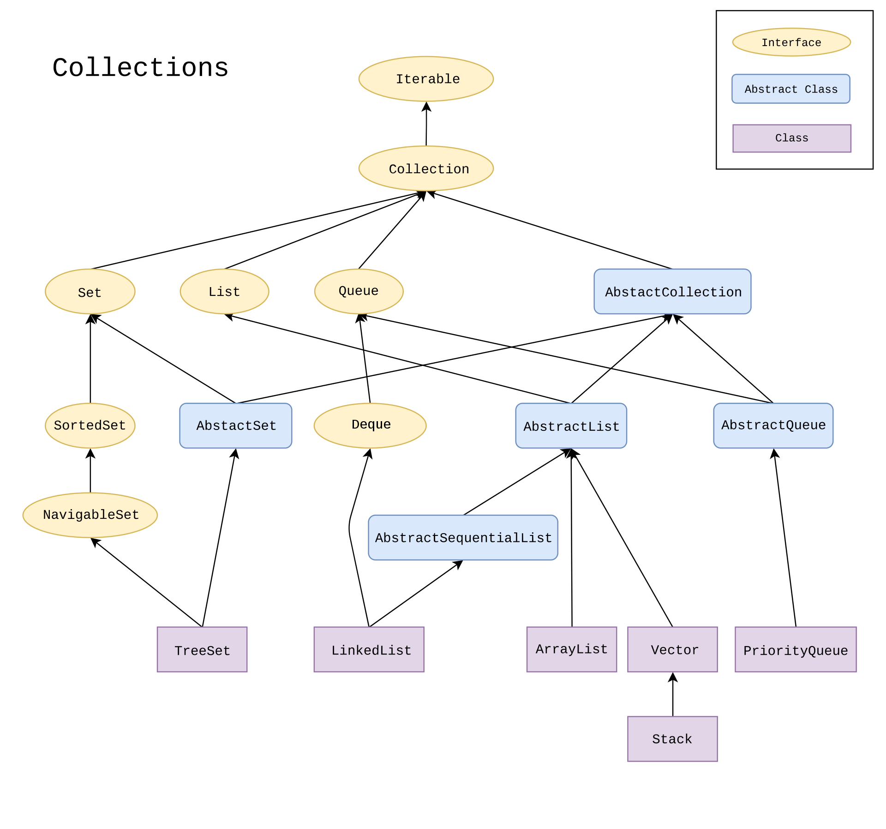

# Java 集合


#### 接口
* Iterable
  * Collection
    * Set: 存储没有重复的对象。
    * List: 存储有序对象。
    * Queue
* Map: 存储键值对。

#### 实现类
* ArrayList
* LinkedList
* Vector
  * Stack
* LinkedHashSet
* TreeSet
* PriorityQueue
* HashSet
* HashMap
* Hashtable
* TreeMap
* LinkedHashMap
* ConcurrentHashMap
* IdentityHashMap

#### 1. ArrayList
1) 内部通过数组实现存储
`transient Object[] elementData;`
2) 可以通过下标访问数据, O(1) 的时间快速随机访问，查找、遍历。
3) 插入删除的代价较大：需要从新开辟新的数组，复制过去。
4) 要存储数据数量大小超过了数组大小时，会重新开辟新的数组，每次增加当前容量的二倍。
5) 线程不安全。

#### 2. Vector
1) 和ArrayList 一样，是通过数组实现存储。
2) 加上了 synchronized 关键字，线程安全。
3) 但效率比 ArrayList 慢。

#### 3. LinkedList
1) 通过双向链表存储数据。
2) 插入和删除效率比较快，查找遍历的速度比较慢。
3) 提供了操作表头和表尾的函数，可以当作栈、队列、双端队列使用。
4) 线程不安全。

#### 4. HashMap
K V 数据结构 快速存储访问 键值对

Java 7:
1) 底层实现是 数组 + 链表
```java
transient Entry<K, V>[] table;
class Entry<K, V> {
  K key; V val; Entry next;
}
```
2) capacity 当前数组的容量
3) loadFactor 负载因子 默认 0.75
4) threshold 扩容阈值 = capacity * loadFactor

问题：随着产生冲突的KV越来越多，链表越来越长。存取操作复杂度 O(n)

Java 8:
1) 当链表长度超过 16 个时将链表改为 红黑树，存取操作 O(log n)
`static final int DEFAULT_INITIAL_CAPACITY = 1 << 4;`

#### 5. LinkedHashMap
1) 维护双向链表 保证插入顺序与遍历顺序一致

#### 6. Hashtable
1) 和HashMap原理相同，但线程安全的
2) 性能比 HashMap 差一些
3) 基本被淘汰 用 ConcurrentHashMap

#### 7. ConcurrentHashMap
Java 1.7
1) 分段锁技术保证线程安全，支持 Segment 数组大小的并发数量
2) 当一个线程访问一个segment时不影响其他的 segment
Java 1.8
1) CAS + synchronized 原理保证线程安全，CAS 利用底层实现原子操作
1) 链表超过一定的阈值 转化为 红黑树

#### 8. TreeMap
1) 有序的键值对，底层是红黑树。
2) 插入 访问 删除 都是 O(log n)
3) 线程不安全

#### 8. TreeSet
1) 底层是 TreeMap，TreeMap 底层是 红黑树。
2) 有序 不重复 的集合，排序需要实现 `Comparable<Person>` 接口或者指定 `Comparator<Person>`
3) 插入 访问 删除 都是 O(log n)
4) 线程不安全
5) 不允许 null 值
6) 要保证线程安全加 `synchornized` 或者
`public static Map<String,String> treemap = Collections.synchronizedMap(new TreeMap<String,String>());`

#### 9. HashSet
1) 无序，存储哈希值
2) 底层是 HashMap

-----------------

#### 1. 集合的选择
需要存 键值对 时，选 Map 接口下的集合，需要排序选 TreeMap，不需要排序选 HashMap，需要线程安全选 ConcurrentHashMap.
只需要存 值 时，选 Collection 接口下的集合，需要唯一选 Set 接口下的 TreeSet/HashSet，不需要唯一选 List 接口下的 ArrayList/LinkedList。

#### 2. 集合框架的底层
* List
ArrayList  -> Object[] 数组
Vector     -> Object[] 数组
LinkedList -> 链表
* Set
HashSet   -> HashMap
LinkedHashSet  -> HashSet + 双向链表
TreeSet   -> TreeMap
* Map
HashMap   -> 数组 + 链表 (7)  数组 + 链表 + 红黑树 (8)
HashTable -> 数组 + 链表 (7)  数组 + 链表 + 红黑树 (8)
TreeMap   -> 红黑树
LinkedHashMap -> HashMap + 双向链表

#### 3. ArrayList 与 LinkedList 区别

Arraylist 底层使用的是数组，存取数据效率高 O(1)，插入删除特定位置效率低 O(n - i)。
LinkedList 底层使用的是双向链表数据结构， 插入，删除效率高 O(1)。
经常需要插入删除元素时选用 LinkedList。
一般程序只用 Arraylist 就够用了，一般数据量都不会蛮大。

#### 4. HashMap 与 HashSet 区别

| HashMap                | HashSet               |
| ---------------------- | --------------------- |
| 实现了 Map 接口        | 实现 Set 接口         |
| 存储键值对             | 存储对象              |
| 使用 key 计算 hashcode | 使用对象计算 hashcode |

#### 5. HashSet 如何检查重复

HashSet 会先计算对象的 hashcode 值，然后计算加入的位置，如果该位置没有其他对象加入过，说明对象没有重复出现。如果发现有相同hashcode 值的对象，这时会调用 equals() 方法来检查 hashcode 相等的对象是否真的相同。如果两者相同，就不会加入。

#### 6. HashMap 长度为什么是 2 的幂次方？

加快通过 hash值 计算位置。
有一步操作是通过 hash 值计算位置 hash % length
如果 length 是 2 的整数次能加快 取余 运算变成 与 运算
hash % length == hash & (length - 1)

例如：length 大小二进制为 b1000
hash % 1000 == hash & 0111

#### 6. 数组与 ArrayList 之间转换/排序
```java
java.util.Arrays.sort(Object[] a, int fromIndex, int toIndex);
java.util.Collections.sort(List<T> list);
List<Integer> list = new ArrayList<>(Arrays.asList(a));
Object[] b = list.toArray();
```
