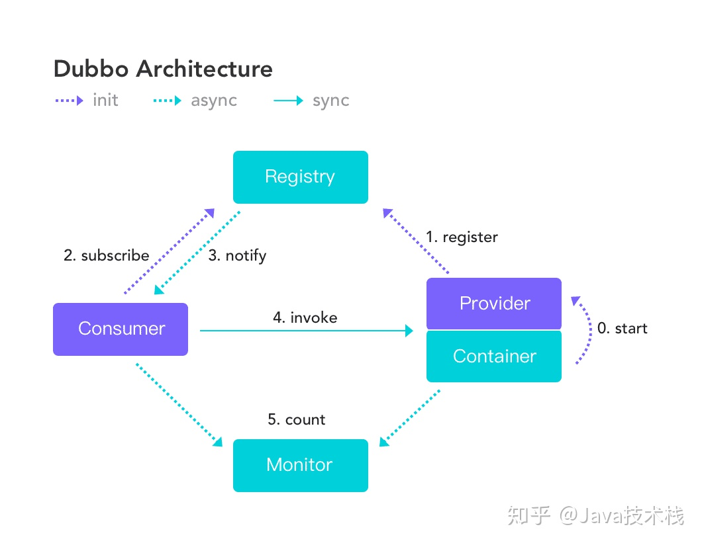

# Dubbo

Dubbo 是分布式 RPC 服务框架。
使用 RPC 通信。
SOA 架构：Service-Oriented Architecture 面向服务架构，把应用的不同单元（服务）进行拆分。通过接口和协议联系起来。

功能有：
NIO 通信和多种协议，服务器动态寻址与路由，软负载均衡与容错，依赖分析与降级。

它有 5 个节点：
provider, consumer, registry, moniter, container
服务提供者，服务消费者，注册中心，监控中心，容器启动服务。

provider: 服务提供方
consumer: 调用远程服务的服务消费方
registry: 服务注册与被发现方
moniter: 统计服务调用次数与调用时间
container: 启动加载运行 provider

1) provider 会向 registry 注册自己的服务。
2) consumer 会向 registry 订阅自己所需要的服务。
3) registry 向 comsumer 返回 provider 地址列表。如果地址有变更，会基于 长连接 推送变更。
4) consumer 基于软负载均衡算法，选一台 provider，如果调用失败就再选一台。
5) consumer 和 provider 累计调用次数，定时向 redistry 报告。

#### zookeeper 作为注册中心是怎么工作的

provider 启动时会在 zk 的 dubbo 节点下新建子节点，类似于 /dubbo/sevicenode/providers/01
该路径下子节点为都为服务提供者，临时节点。
moniter 在服务节点上注册 watcher 监听节点变化 /dubbo/sevicenode/，能感知 provider 宕机。
consumer 也是在 zk 中创建 临时节点。

