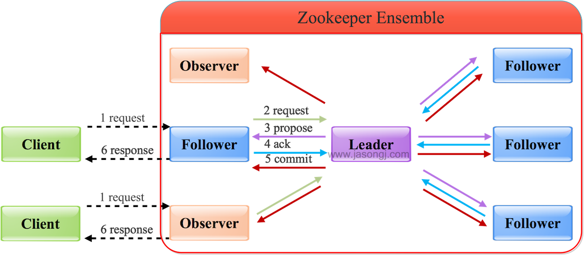
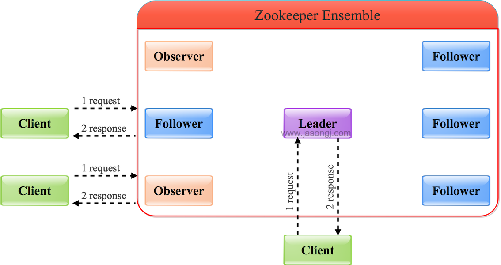

# Zookeeper

例子：配置文件的管理
分布式应用配置文件一致性

树形结构管理数据
每个节点 znode，有唯一的路径。
每个 znode 只能少量数据 2MB
znode状态：临时节点，顺序节点，持久节点

leader, follower, observer

wacher 监听机制。

保证自身可用性
2PC 两阶段提交
3 阶段提交

paxos 算法，一致性算法

应用：
统一命名服务 申请 id
创建节点 顺序节点

集群管理 监测

集群利用 zk 选举 master节点
5 个节点向 zk 上创建临时节点

Hadoop HA
主从 namenode 切换，共享 editlog

-----------------------

zookeeper = 小型文件系统 + 通知机制

观察者模式

只要半数以上就能工作。

全局数据一致，几个服务器，几个数据副本。

树形结构 

每个 znode 默认只能存 1MB

每个znode 可以通过路径唯一标示

统一命名管理，统一配置管理，统一集群管理，服务器动态上下线，负载均衡。

#### 1. 介绍一下 zookeeper 
zookeeper 是分布式应用协调管理服务，提供一致性服务。
通过树形结构管理数据，每个节点叫 znode，都有唯一的路径表示。
每个 znode 节点只能存少量的数据，分为临时节点，持久节点。
临时节点：当客户端与服务器断开连接后，znode 就会删除。
持久节点：断开不会删除。

zk 是一个分布式的系统，多个节点组成，节点的角色分为 leader，follwer，observer。

有超过半数以上节点正常运行，zk 就能正常运行。

提供统一配置管理，统一命名管理，集群管理，分布式锁功能。

#### 2. zk 的应用实例

统一配置管理：
比如有 3 个系统 A，B，C，每个系统各有 1 份配置文件，这 3 份配置文件需要完全一样，就可以把这份文件拿出来，用 zk 管理，放到一个 znode 节点下面。ABC 监听这个节点。

统一命名服务：
相当于 ip 与 域名，给一个资源取个名放 znode 下，别的节点就可以通过名字拿到。
一个域名下挂这多台机器，有多个 IP，我们通过访问域名得到 ip。

分布式锁：
A，B，C 都去一个地址下创建 znode，创建临时带序号的节点，判断自己的序号是不是最小的，如果是，拿到锁，执行完操作后，把节点删掉。

集群管理：
A, B, C 各自维护一个临时节点在 /group/下面，监听 /group/ 下的子节点。
如果 A 挂了，/group/A 删除, B，C 能感知到 A 挂了。

#### 3. ZAB 协议

ZAB 协议保证了各个 server 间的同步。

是 zk 支持崩溃恢复的原子消息广播协议。
ZAB 协议包括 2 种模式：故障恢复 和 消息广播。

故障恢复：
当整个 zk 集群刚刚启动或者Leader服务器宕机、重启或者
网络故障导致不存在过半的服务器与 Leader 服务器保持正常通信时，所有服务器进入崩溃恢复模式。
首先选举产生新的 Leader 服务器，然后集群中 Follower 服务器开始与新的 Leader 服务器进行数据同步。当集群中超过半数机器与该 Leader 服务器完成数据同步之后，退出恢复模式进入消息广播模式，Leader 服务器开始接收客户端的事务请求生成事物提案来进行事务请求处理。

广播模式：
只允许 leader 接收客户端事务请求，leader 收到请求后，将请求转化为 proposal。
leader 会为每个 follower 创建一个队列，将事务放到队列中保证顺序性。
按顺序向 follower 广播事务，follower 收到事务后，写入本地日志，并向 leader 发送 ACK。
当 leader 收到半数以上的 ACK 时，发送 commit 消息，同时 leader 提交该事务。

leader 重新选择的条件：leader 发生宕机或故障，至少有过半的服务器正常。

#### 4. paxos 算法

#### 5. zookeeper 中某个机器挂了，整个集群如何处理？

如果是 follower 宕机，zk 集群一般还可以继续提供服务，数据不会丢失。
如果是 leader 宕机，zk 会选出新的 leader。
只要集群中超过半数以上 server 正常 zk 就能正常提供服务。

#### 6. fastlearderelection 选举 leader 算法

myid: 集群中机器唯一 id
zxid: 事务 id，标示 proposal id，全局递增。
64 位数，高 32 位数是 leader 的 epoch，每选出一个 leader epoch + 1。
低 32 位为序号，每次 epoch 加 1，序号清零。
logicClock: 第多少轮投票

基于 TCP 的 FastLeaderElection，是 Fast Paxos 算法实现。

状态 looking, following, leading, observing。

选票结构：
self_id: my_id
self_zxid: 当前服务器上的 zxid
vote_id: 被选服务器 my_id
vote_zxid: 被选服务器上的 zxid

启动时的选举：
加入有 5 台机器 my_id：1, 2, 3, 4, 5
1) 1 启动，将票投给自己，并进行广播，收不到应答，处于 looking 状态。
2) 2 启动，将票投给自己，并进行广播，1 中更新为 2，(1 < 2),没过半数，处于 looking 状态。
3) 3 启动，将票投给自己，并进行广播，1，2 中更新为 3. 过了半数，成为 leader，3:leading 状态。1，2: following 状态。
4) 4，5 启动，将票投给自己，并进行广播，但已经存在 leader，4，5 是 following 状态。

中途有 leader 宕掉的选举：
1) 逻辑时钟小的选举结果被忽略，重新投票（除去选举次数不完整的服务器）
2) 统一逻辑时钟后，数据id大的胜出（选出数据最新的服务器）
3) 数据id相同的情况下，服务器id大的胜出（数据相同的情况下， 选择服务器id最大，即权重最大的服务器）

#### 7. zk 如何保证数据一致性？

通过 ZAB 协议保证数据一致性，
ZAB 协议包括 2 中模式：恢复模式 和 广播模式。

#### 8. 读写操作

写 leader
1) 客户向 leader 发起写请求。
2) leader 将写请求转化为 proposal，发送给所有的 follower
3) follower 接收到 proposal 返回 ACK
4) leader 接收到超过半数以上 ACK，给 follower 和 observer 发送 commit
5) leader 将处理结果返回给客户端。

observer 无投票权，不会发送 ACK

写 follower/observer
将写请求转发给 leader

读 leader/follower/observer
可以直接处理，将内存中的数据返回给客户端。

