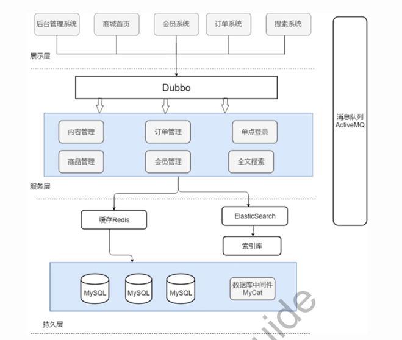

B2B, B2C 电商平台。

SpringMVC 进行分层解藕。
Dubbo 分布式服务框架。
Dubbo 的 registry 注册中心选择的 zookeeper。
RabbitMQ 消息队列。消息削峰，同步，异步。
Redis 缓存。存热门商品。

1. 微信端订单模块后台。
预售订单与真实订单
加入购物车
下单系统 后端系统的接口
 - dubbo 的 RPC 调用下单

付款 收到短信

* 商家地图模块。
百度地图 API 地址

人员配置：
2 * 前端
4 * 后台
1 * 架构师
2 * 测试
1 * 安卓
1 * iOS

