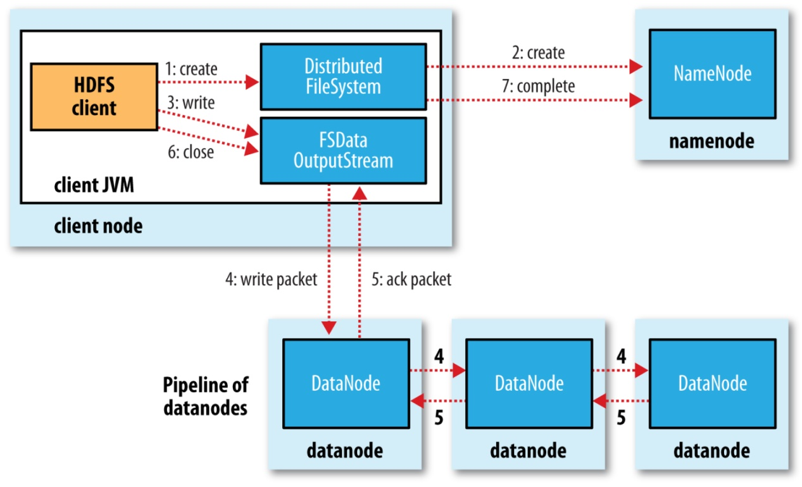
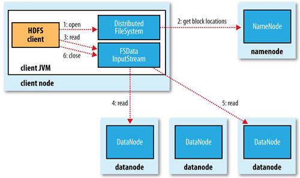
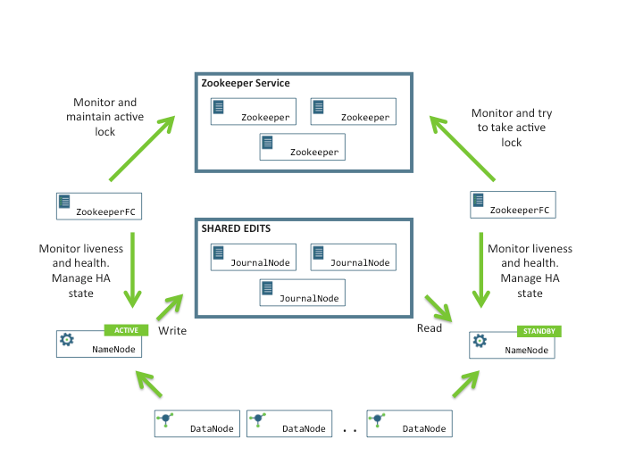
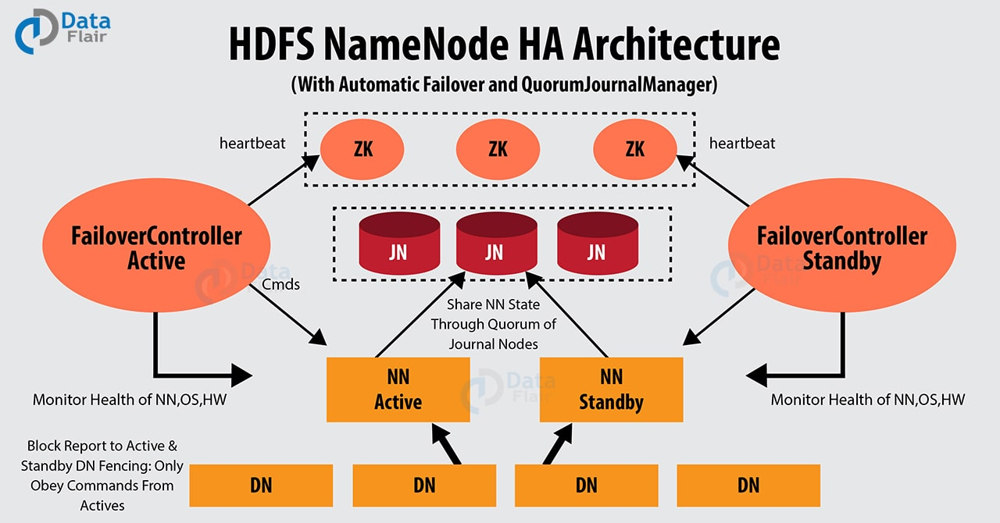

# Hadoop

### HDFS
分布式文件系统，文件分块存储，块大小 128 MB，可以设置。

为什么块大小设置很大，比磁盘块大？
减小寻址开销。

packet：客户端与 datanode，pipline 之间数据传输的基本单位，默认64KB
chunk：客户端与 datanode，pipline 之间数据传输的数据校验。

namenode
secondary namenode
datanode

namenode：
1). 管理文件系统的命名空间，记录文件系统树（元数据）。
2). 保存 fsimage 和 editlog。fsimage 定期持久化。
3). 有个文件记录数据块在 namenode 中的位置。但不保存到硬盘，而是启动时从 datanode 收集来的。

datanode：
1). 文件系统的存储节点，实际保存块数据的地方。
2). 定期向 namenode 发送存储块列表。

secondary namenode: 
1). 定期将edit log 和 fsimage 合并，防止文件过大。
2). 保存 fsimage 副本。namenode 失败时可以恢复，成为新的 namenode。

#### 1. HDFS 写入过程

1) 客户端调用 FileSystem 对象的 create 方法。
2) FS 对 namenode 远程 RPC，请求写入文件。namenode 会做各种检查，检查文件是否存在，是否拥有写权限等。如果通过，namenode 会将文件元数据写入 edit log，FileSystem 会返回 FSDataOutputStream 用于 客户端 向 datanode 写入数据。
3) FSDataOutputStream 将要写入的数据分成 packets，packets 会保存在 data queue，由 DataStreamer 处理，DataStreamer 请求 namenode 返回的 datanode 列表，将 packets 写入到 datanode。
如果副本数为 3，那么 namenode 返回 3 个 datanode，串联一起形成一条 pipeline。DataStreamer 将 packet 写入到 datanode1，datanode1 将 packet 发给 datanode2，datanode2 发给 3. pipline 反方向上回发送 ACK packet，最终由第一个 datanode 发送 ACK 给客户端。
4) FSDataOutputStream 为了确保 packet 成功写入，维护一个 ACK queue，只有当 packet 成功写入每个 datanode 后，才回被移除。
5) 完成文件写入后，客户端调用 FSDateOutputStream.close() 方法，关闭流，然后向 namenode 发送写入完成。

#### 2. 如果写入过程中，某个 pipeline 中的 datanode 有问题会怎样

1) 关闭 pipeline。
2) ACK queue 中的数据重写回 data queue (未收到确认的 packet 写回 data queu) 防止问题 datanode 节点下游数据丢失。
3) 当前正常工作的 datanode 被赋予一个新的版本号，问题 datanode 被剔除。
4) 正常的 datanode 中选出一个 主datanode，并与其他 datanode 通信。同步当前数据块大小，选择最小的。
5) 建立新的 pipeline，把剩下的数据写入。
6) 写入完毕后，namenode 发现副本数不足会在另一个节点上创建副本。

#### 3. HDFS 读取过程

1) 客户端调用 FileSystem 的 open 方法。
2) FileSystem 通过 RPC 向 namenode 请求文件，namenode 返回保存 block 的 namenode 地址。block 有多个副本，namenode 返回的是与 客户端距离最近的那个地址。为了节约带宽。
3) FileSystem 返回 FSDateInputStream 对象。客户端调用 read 方法读取数据，向 datanode 获取 block 数据，当最后一个 block 返回到客户端后，FSDateInputStream 关闭与 datanode 的连接。然后连接下一个 block 的 datanode。
4) 读取完数据后，调用 FSDateInputStream 的 close 方法。

#### 4. 读取 block 的时候 datanode 出错了会怎样
1) 客户端尝试与存有该 block 副本最近的 datanode 通信。
2) 记录该 datanode，报告给 namenode，之后数据通信不再与该 datanode 通信。

#### 5. Fsimage 与 Editlog 的合并过程
Fsimage：命名空间映像文件，是内存中的元数据在硬盘上的 checkpoint，包含文件系统中所有目录和文件 inode 序列化信息。
Editlog：记录文件系统写操作。

1) secondary namenode 每隔 5 分钟，通过 getEditLog() 获取 editlog 的大小，当达到合并大小时，通过 RollEditLog 方法进行合并。
2) namenode 停止使用 editlog，生成一个新的 edits.new 
3) secondary namenode 通过 namenode 中的 HTTP 服务器，以 get 方式获取 edits 和 fsimage。
4) secondary namenode 将 fsimage 载入内存，并按顺序执行 edits 中的操作，生成新的 fsimage 。
5) 结束后向 namenode 发送 HTTP 请求告知合并结束，namenode 通过 HTTP post 方法得到新的 fsimage。
6) namenode 更新 fsimage
7) edits.new 改名为 edits

因为 secondary namenode 与 namenode 有相似的内存需求，合并消耗资源，所以secondary namenode 运行在另一台专门的机器上。

#### 6. 联邦 HDFS

namenode 的水平扩展，可以创建多个 namenode，每个 namenode 管理文件系统命名空间的一部分，不同的 namenode 之间命名空间相互独立。每个 datanode 要向集群所有 namenode 注册。

每个 NN 都定义一个存储池，有单独的 id，每个 DN 会为所有 NN 提供存储。DN 会按照存储池 id 向相应的 NN 汇报块信息，向所有 NN 汇报本地的可用资源。

优点：
1) 命名空间 水平扩展，解决了大规模集群部署和有众多小文件的情况。
2) 多个 namenode 共用一个集群 datanode，每个 namenode 都可以单独对外服务，增大了吞吐量。

如果客户端方便访问多个 NN 资源，可以使用客户端挂载表，把不同的目录映射到不同的 NN。

#### 7. HDFS HA 机制

1) 集群中有多个 namenode，namenode 状态分为 acitve 和 standby。
2) 各个 namenode 通过共享文件系统存储 editlog，active NN 将写入信息写入共享的 editlog，standby NN 读取该 editlog 保持与 active 同步。
3) active NN 负责接收客户端请求，写入 editlog 同时也向 journalnode 集群写入。
4) journal node 用于 active NN 与 standby NN 同步
5) datanode 向所有的 NN 发送数据块报告。
6) 每个 NN 中运行 ZKFC (ZookeeperFailoverController)进程，用于监视和控制 NN 进程
7) ZKFC 启动时会创建 HealthMonitor 和 ActiveStandbyElector 两个组件，并注册回调方法。
   1) HealthMonitor 用于检查 NN 状态变化，如果有状态变化调用相应的方法进行处理。
   2) ActiveStandbyElector 主要完成主备选举，内部是 zookeeper 选举逻辑，一旦 zookeeper 选举完成，回调 进行 NN 主备切换。
   3) ActiveStandbyElector 与 zookeeper 交互完成主备选举，完成后调用 ZKFC 相应的方法切换当前节点的状态。

脑裂 brain-split: NN1 为 active 状态，NN2 为 standby 状态，某一时刻，NN1 上的 zkfc 出现假死，zookeeper 会认为 NN1 挂掉了，会切换 NN2 为 active，此时 NN1 仍为 active。NN1 和 NN2 同时处于 active 状态，都可以进行服务，会发生数据错乱，无法恢复。

zookeeper 客户端机器负载过高或者正在进行 JVM Full GC，zookeeper 客户端的心跳无法正常发出，超过了 timeout 后就被 zookeeper 服务端 session 关闭。

防止脑裂：fencing 
两种 fencing：sshfencing 和 shellfencing。
sshfencing 是通过 ssh 登陆目标节点 kill 掉进程。
shellfencing 是执行特定 shell 脚本。

### Mapreduce

计算框架，编程范式。

map：是映射，负责把原始数据过滤，转化为键值对输出。
reduce：是合并，把具有相同的 key 值的 value 处理，再输出新的 键值对 作为最终的结果。

#### 1. MR 的 shuffle 机制

map 端的输出，到 reduce 的输入，需要进行 shuffle。
为了让 reduce 可以并行处理 map 的输出，对 map 的输出进行排序，分组。
shuffle 是将 map 输出数据转化到 reduce 输入数据的过程。

shuffle 包括 map shuffle 和 reduce shuffle。

map shuffle 包括 partition分区，sort排序，spill溢出。map 任务输出写到一个环形内存缓冲区，当缓冲区达到 80% 后，将数据写入（spill）到磁盘，形成 spill 文件。

在将缓冲区数据写入到磁盘之前，会将数据进行分区：partitioner 对 key 进行 hash 取模，映射到分区。取模值与 reducer 数量一样。有几个 reducer 就会有几个 patition。

每个分区中数据按 key 进行排序。接着运行 combiner 将 key 进行本地聚合，以减少向 reducer 传输数据量。

如果 map 输出的数据量很大，spill 文件就很多，最后需要将所有的 spill 进行 merge 输出。

reduce shuffle 进行复制和合并，reduce 任务中有多个 复制线程，可以并行从多个 map 任务中获得数据。

reduce 任务可能需要多个 map 的输出，只要其中一个 map 完成，就可以拿数据。

如果 map 输出数据很小，会直接复制到内存。如果数据很多，会溢出到磁盘。最后排序合并这些溢出的文件。

### Yarn

集群的资源管理。

ResourceManager: 全局的资源管理调度。
   - ApplicationMaster
   - Scheduler: 调度器
NodeManager

container: 
容器，yarn 对资源的封装。
由 NodeManager 启动和管理，被监控。
被 ResourceManager 调度。

ResourceManager：
负责全局的资源管理调度。一个 hadoop 集群只有一个。
包含两个组件：ApplicationMaster 和 Scheduler。

Scheduler：
资源调度器，一种算法，根据所需资源和集群资源情况进行分配。
仅仅分配资源，不做监控、跟踪应用运行状态。

ApplicationMaster：
每个应用都对应一个 ApplicationMaster。
负责向 Scheduler 获取容器资源 container，监控并跟踪应用状态。
获得容器资源后，将程序发送到容器上启动。

NodeManager：
每台机器上都有一个。
负责容器管理，监控cpu，内存、磁盘、网络资源，并向 ResourceManager 汇报。

#### 1. mapreduce 任务在 yarn 上的工作流程。

1) 运行 hadoop jar 命令后，产生 RunJar 进程，客户端向 ResourceManager 申请执行一个 job。
2) ResourceManager 返回资源提交路径和 JobID。
3) 客户端将 job 资源提交到共享文件目录下 .../yarn-staging/JobID/
4) 客户端向 ResourceManager 汇报提交结果，ResourceManager 将 job 加入队列。
5) NodeManager 通过与 ResourceManager 心跳连接，从任务队列领取任务。
6) 调度器 Scheduler 为 NodeManager 分配所需的资源，NodeManager 创建 container。
7) ResourceManager 在容器中启动 AppMaster
8) AppMaster 负责分配在哪些 NodeManager 运行 map/reduce，yarnchild 进程。
9) 运行 map/reduce 任务的 NodeManager 从共享目录下拿job相关资源，包括 jar包，配置文件等。
10) job 运行完后，AppMaster 向 ResourceManager 注销自己，ResourceManager 回收资源。

mapreduce counter: 计数器用来记录 job 的运行状态和进度。相当于日志，但比日志好分析，可以在 mr 程序中插入计数器。
