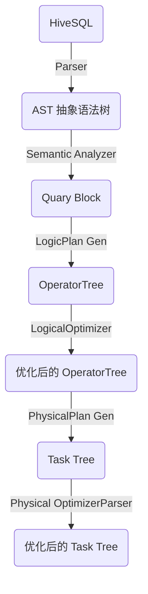

# Hive

Hive 是基于 hadoop 数据仓库工具。

#### 1. Hive 与传统数据库的区别

1) 传统数据库是 写时模式 schema on write，hive 是 读时模式 schema on read，只有读时才对数据进行解析，不符合模式的数据直接为 NULL。

读时模式加载数据非常快。仅是数据的复制移动。
写时模式预先进行解析建立索引，压缩，这样查询很快，但写入加载慢。

2) hive 具有复杂的数据结构。
3) hive 不支持实时的数据处理。
4) hive 不支持行级插入。
5) hive 不支持事务。
6) hive 延迟高，数据量大，多存储在 HDFS 上。

#### 2. Hive 内部表和外部表区别

创建表：内部表会将数据移动到 hive 指定的位置，hive 管理数据的生命周期。外部表仅记录数据的位置，不会移动。

删除表：内部表元数据和数据都会被删除。外部表只删除元数据。

外部表组织更加灵活，安全。

选择：如果数据全由 hive 处理，选择内部表。如果数据由 hive 和其他工具一起处理选择外部表。

#### 3. 数据倾斜

数据分布不均匀，大量数据集中在一个 key 中。

表现：任务进度长期停在 99%，只有少量或 1 个 reduce 任务未完成。
以为处理的数据量和其他 reduce 任务差异过大。

原因：
1) key 分布不均匀。
2) 业务数据本身的特性。
3) 建表时考虑不全。
4) 某些 SQL 语句本身就有数据倾斜问题。

目标：使 map 输出更均匀的分布到 reduce 中。

解决：
1) map 端：

hive.map.aggr=true
map 端部分聚合

hive.groupby.skewindate=true
有数据倾斜时进行负载均衡。会生成 2 个 mr job，第一个 job 的 map 输出结果集合会随机分到 reduce 中，每个 reduce 做部分聚合，并输出结果，相当于 group by key，有可能被分发到不同的 reduce 中达到负载均衡的目的。第二个 MR Job 再根据预处理的数据结果按照 Group By Key 分布到 Reduce 中（这个过程可以保证相同的 Group By Key 被分布到同一个 Reduce 中），最后完成最终的聚合操作。

2) SQL 语句调节

2.1 join 
选择 join key 分布最均匀的做驱动表，做好列剪裁和 filter, 使两个表做 join 时数据量变小。

大小表 join
使用 map join 让小的表（1000 条一下）先进内存，map 端完成 reduce。

大表 join 大表
把空值 key 换成字符串 + 随机数。把倾斜数据放到不同的 reduce 上

2.2 count distinct 大量相同的 特殊值

如果特殊值为 NULL，单独处理。
如果大量特殊值不为空，直接过滤，结果 + 1。
如果 NULL 还需要其他计算如 group by，可以先 空 单独处理，在和其他计算结果 union。

2.3 group by 纬度过小

2.4 特殊情况
一般在业务逻辑优化效果的不大情况下，有些时候是可以将倾斜的数据单独拿出来处理。最后union回去。

#### 4. HQL 转化为 mapreduce 的过程

