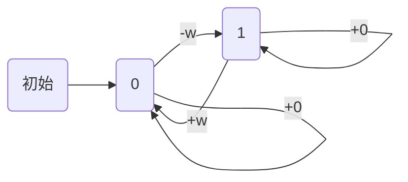

# 状态机 DP

买股票的最佳时机 IV
https://leetcode-cn.com/problems/best-time-to-buy-and-sell-stock-iv/

2 个状态：
目前无股票 0  f
目前持有股票 1 g

状态：
f[i, j]: 第 i 天，已经完成 j 笔交易 的利润
g[i, j]: 第 i 天，正在进行第 j 笔交易（未完成）的利润

转移：
f[i, j] = max(f[i - 1, j], g[i - 1, j] + w[i])
g[i, j] = max(g[i - 1, j], f[i - 1, j - 1] - w[i])

初始：
f[0, 0] = 0
