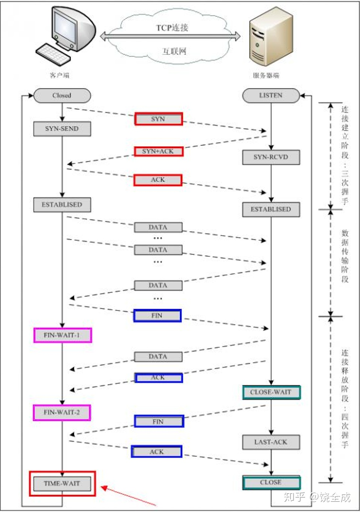
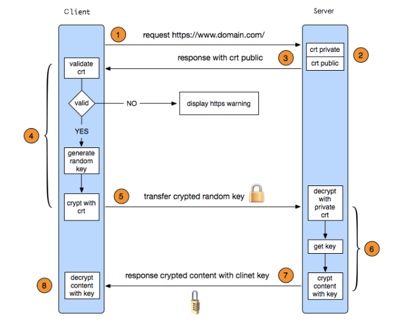

# 计算机网络

#### 1. TCP/TP 协议族


| TCP/IP 4层 | TCP/IP 5层 | &nbsp;&nbsp;&nbsp;&nbsp;&nbsp;&nbsp;&nbsp;&nbsp;&nbsp;&nbsp;&nbsp;OSI 7层 &nbsp;&nbsp;&nbsp;&nbsp;&nbsp;&nbsp;| 协议                                | 功能                                                                     | &nbsp;&nbsp;&nbsp;&nbsp;&nbsp;&nbsp;&nbsp;&nbsp;&nbsp;&nbsp;&nbsp;&nbsp;&nbsp;&nbsp;&nbsp;&nbsp;设备 &nbsp;&nbsp;&nbsp;&nbsp;&nbsp;&nbsp;&nbsp;&nbsp;&nbsp;              |
| ---------- | ---------- | -------- | ----------------------------------- | ------------------------------------------------------------------------ | ------------------ |
| 应用层     | 应用层 | 应用层 | HTTP, FTP, DNS              | 面向用户，提供应用服务                                                   ||
|            |            | 表示层     |                                     | 数据格式的转换，压缩与解压缩，加密与解密。                               ||
|            |            | 会话层     |                                     | 两个节点间建立、维护和释放面向用户的连接                                 ||
| 传输层     | 传输层     | 传输层     | TCP, UDP                            | 提供端对端的通信服务                                                     ||
| 网络层     | 网络层     | 网络层     | IP                                  | 提供路由和寻址功能，实现两个终端互联，最佳路径，具有拥塞控制，流量控制。 | 路由器、防火墙 |
| 网络接口层 | 数据链路层 | 数据链路层 | IEEE802.11(WiFi), IEEE802.3(以太网) | 数据链路连接的创建、维持和释放管理                                       | 网卡、网桥、交换机 |
|            | 物理层     | 物理层     | RS-232                              | 信号与介质                                                               | 中继器、集线器     |


#### 2. TCP 和 UDP 的区别

| TCP            | UDP         |
| -------------- | ----------- |
| 面向连接       | 非面向连接  |
| 可靠           | 不可靠      |
| 字节流         | 数据报文    |
| 慢             | 快          |
| 所需资源多     | 所需资源少  |
| 首部20-60 字节 | 首部 8 字节 |



#### 3. TCP 3 次握手

1). 客户端  ----SYN---> 服务端 : 客户端发送带有 SYN 标志的数据包

2). 客户端  <--SYN/ACK- 服务端 : 服务端发送带有 SYN/ACK 标志的数据包

3). 客户端  ----ACK---> 服务端 : 客户端发送带有 ACK 标志的数据包

第一次握手：客户端 通过向 服务器 发送一个含有同步序列号的标志位的数据段，向 服务器 请求建立连接，通过这个数据段，客户端 告诉 服务器 两件事：我想要和你通信；你可以用那个序列号作为起始数据段来回应我。

第二次握手：服务端 收到 客户端 的请求后，用一个带有确认应答（ACK）和同步序列号（SYN）标志位的数据段响应 客户端，也告诉 客户端 两件事：我已经收到你的请求了，你可以传输数据了；你要用那个序列号作为起始数据段来回应我。

第三次握手：服务端 收到这个数据段后，再发送一个确认应答，确认已收到 客户端 的数据段："我已收到回复，我现在要开始传输实际数据了，这样3次握手就完成了，客户端 和 服务端 就可以传输数据了。

* ACK 是TCP报头的控制位之一，号为X，则表示前X-1个数据段都收到了，只有当ACK=1时,确认号才有效，当ACK=0时，确认号无效，这时会要求重传数据，保证数据的完整性。
* SYN 同步序列号，TCP建立连接时将这个位 set 1。
* FIN 发送端完成发送任务位，当TCP完成数据传输需要断开时, 提出断开连接的一方将这位置1。

#### 4. 4 次挥手

1). 主动关闭方 ----FIN---> 被关闭方
2). 主动关闭方 <---ACK---- 被关闭方
3). 主动关闭方 <---FIN---- 被关闭方
4). 主动关闭方 ----ACK---> 被关闭方

#### 5. 为什么需要 3 次握手

收发双方确认 自己 和 对方 的 发送和接受正常。
第一次握手，服务端确认自己接收正常，对方发送正常。
第二次握手，客户端确认自己发送和接收正常，对方发送正常。
第三次握手，服务端确认自己发送正常，对方接收正常。

#### 6. 为什么需要 4 次挥手

TCP是全双工通信，断开连接时，需要服务端和客服端都确定对方将不再发送数据。

第一次挥手，客户端向服务端发 FIN 报文，代表客户端不再发送数据了。
第二次握手，服务端向客户端发 ACK 报文，确认收到。
第三次挥手，服务端向客户端发 FIN 报文，代表服务端不再发送数据了。
第四次挥手，客户端发 ACK，确断开。

#### 7. 为什么不是 3 次挥手

客户端第一次挥手后，服务端可能还在发送数据。
不回 ACK 会引发 FIN 报文不断发送。

#### 8. 为什么不是 2 次握手

收发双方各种维护一个同步序列号，
如果 2 次握手，连接发起方序列号会得到确认，另一方同步序列号不会得到确认。

#### 9.TCP 流量控制

发送者发送过快，接受者来不及接受导致分组丢失。

流量控制：控制发送者的发送速度，使接受者来得及接收

由滑动窗口协议实现，保证了分组无错，有序接收，流量控制。
接收方返回的 ACK 包中包含自己接收窗口的大小，利用大小控制发送方的速度。

#### 10. 流量控制死锁

当发送者收到了窗口为 0 的 ACK，便停止发送。但 0 ACK 丢失，发送者与接收者就相互等待，产生死锁。

TCP 使用 持续计时器解决。每当发送者收到一个零窗口的应答后就启动该计时器。时间一到便主动发送报文询问接收者的窗口大小。若接收者仍然返回零窗口，则重置该计时器继续等待；若窗口不为0，则表示应答报文丢失了，此时重置发送窗口后开始发送，这样就避免了死锁的产生。

#### 11.拥塞控制

拥塞控制作用于网络，防止过多的数据注入网络，网络负载过大。

慢开始，快重传，快恢复。

#### 12.HTTP 请求报文结构

请求行
请求头部
空行
请求数据

```
GET /index.html HTTP/1.1 
Accept: image/gif, image/x-xbitmap, image/jpeg, image/pjpeg, application/vnd.ms-excel, */*
Accept-Language: zh-cn  
Accept-Encoding: gzip, deflate  
User-Agent: Mozilla/4.0 (compatible; MSIE 6.0; Windows NT 5.1; SV1; .NET CLR 2.0.50727; TheWorld)  
Host: <a href="http://www.google.cn">www.google.cn</a>  
Connection: Keep-Alive  
 
```

#### 12.HTTP 相应报文结构

状态行
消息报头
响应正文

```
HTTP/1.1 200 OK　　状态行
Date: Sun, 17 Mar 2017 08:12:54 GMT　　响应头部
Server: Apache/2.2.8 (Win32) PHP/5.2.5
Expires: Thu, 19 Nov 1981 08:52:00 GMT
Cache-Control: no-store, no-cache, must-revalidate, post-check=0, pre-check=0
Content-Length: 4393
Keep-Alive: timeout=5, max=100
Connection: Keep-Alive
Content-Type: text/html; charset=utf-8
　　空行
<html>　　响应数据
<head>
<title>HTTP响应示例<title>
</head>
<body>
Hello HTTP!
</body>
</html>

```

#### 13. GET 与 POST 的区别

GET 会把请求数据放在 URL 后面。
POST 请求数据放在 HTTP 包里。

URL 长度会受到 浏览器 和 服务器的限制。
所以 GET 请求数据长度有限制，POST 请求数据大小无限制。

POST 安全性比 GET 高。数据放 URL 中不安全。

#### 14. HTTPS 的连接请求过程

1). 域名解析
2). 发起 TCP 3次握手
3). 建立 TCP 连接后发起 http 请求
4). 服务器响应请求，返回结果
5). 浏览器得到 html 标签代码
6). 浏览器解析 html 代码中的资源，例如js，css，img等
7). 浏览器对页面进行渲染并呈现给用户

#### 15. HTTP 1.0/1.1/2.0

HTTP 1.0 浏览器与服务器只有短连接，浏览器每次请求与服务器建立 TCP 连接，服务器处理完请求后马上断开连接。

HTTP 1.1 支持长连接 connection: keep-alive，一个 TCP 可以传多个 HTTP 请求和相应。

HTTP 2.0 新特性：多路复用，新的二进制格式，服务器推送。

#### 16. HTTPS 的加密过程

HTTP 与 TCP 之间增加了 SSL/TLS层(安全套接层Secure Sockets Layer/安全传输层Transport Layer Security)。使用 HTTPS 要有一套数字证书，公钥和私钥。

HTTPS 解决的问题：

* 信息加密传输：第三方无法窃听。
* 校验机制：一旦篡改，双方都会发现。
* 身份证书：防止身份冒充。

加密过程：
1) 客户端向服务器请求获取证书公钥。
2) 服务器返回证书公钥。
3) 客户端 SSL/TSL 解析。
4) 客户端生成随机值。
5) 客户端用公钥加密随机值，生成密钥。
6) 密钥发送给服务端。
7) 服务端用私钥解密密钥得随机值。
8) 将随机值与要发送的内容混在一起（对称加密），发送个客户端。
9) 客户端用密钥解密（对称加密）得到内容。




